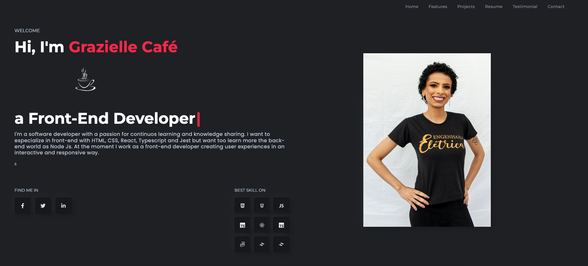

# Site Pessoal - Portfólio

## 1. Stacks usadas: 

 

 
## 2. . :closed_book: Descrição 
Neste repositório está a criação de um portfólio pessoal. 

## 2.  :ballot_box_with_check: Site construído 

## 4. Página de acesso 
https://graziellecafe.github.io/portfolio/
